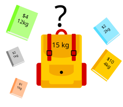

# Abstract Problem Classes

[https://neetcode.io/practice?tab=blind75](https://neetcode.io/practice?tab=blind75)

## 📑 Table of Contents

**[🧨 High Frequency Tier](#high-frequency-tier) (Core OA Hits)**

1. [Greedy + Binary Search on Answer](#greedy-binary-search) (BS on Minimum Sufficient Resource)
2. [Sliding Window / Two Pointers](#sliding-window-two-pointers)
3. [Subarray with Target Sum](#subarray-target-sum) (prefixSum − k + hashmap)
4. [🎒 Bounded Knapsack (0/1)](#bounded-knapsack)
5. [DP on Substrings / Subsequences](#dp-substrings-subsequences)
6. [⛰️ Heap / Top-K Selection](#heap-top-k)

**[🔁 Medium Frequency Tier](#medium-frequency-tier) (Often Embedded in Complex Variants)**

7. [Sliding Window + Monotonic Structure](#sliding-window-monotonic)
8. [Topological Sort (DAG)](#topological-sort-dag)
9. [Prefix Sum with Boundary Anchors](#prefix-sum-boundary-anchors)
10. [Greedy Simulation with Delay Enforcement](#rate-limited-execution) (Rate-Limited Execution)
11. [🗺️ BFS Shortest Path on Grid](#bfs-shortest-path-grid) (Single-Source)

**[🧮 Specialized but Frequent in SDE-2](#specialized-tier)**

12. [Weighted Interval Scheduling](#weighted-interval-scheduling)
13. [Greedy Interval Scheduling (Non-Weighted)](#greedy-interval-scheduling)
14. [🪙 Unbounded Knapsack (Complete Pack)](#unbounded-knapsack)
15. [Longest Increasing Subsequence (LIS)](#longest-increasing-subsequence)
16. [🏗️ Design: O(1) Composite Data Structures](#design-o1-composite-structures) (LRU Cache)
17. [Stubs](#stubs): Lexical Constrained Search · Union-Find / Grid Labeling · Flood Fill with Level Tracking
18. [📋 Master Summary Table](#master-summary-table)

Yes. To **master Amazon SDE-2 OA/Interview**, you must internalize a set of **abstract problem classes**—these are **recurring hidden structures** behind many Amazon questions.

Here’s a list of **high-leverage abstract classes** Amazon loves:

<a id="high-frequency-tier"></a>
## 🧨 High Frequency Tier (🔥 Core OA Hits)

<a id="greedy-binary-search"></a>
## **Greedy + Binary Search on Answer (BS on Minimum Sufficient Resource)**

### 🧠 Core Problem Type:

> Binary Search on Answer
> 
> 
> (also called **Binary Search on Minimum Sufficient Resource**)
> 

---

### 🗣️ Mental Ping Phrase:

> “Binary Search on Minimum Resource problem — the more speed/resources I use, the more likely I can meet the constraint. The valid region is monotonic, so I can binary search the smallest value that still passes.”
> 

---

### ✅ Common Signature of This Pattern:

| Property | Description |
| --- | --- |
| Input is **unsorted** | You **can’t sort or rearrange** to solve it |
| You're looking for a **minimum** or **maximum** value that satisfies a constraint | "Minimum k that works", "Maximum X we can fit", etc |
| There exists a **monotonic predicate** over candidate values | If k works, all k+1... work (or vice versa) |
| You have a **feasibility check function** (e.g., canFinish(k)) | Used as predicate in BS |
| Direct simulation would be O(n⋅range), BS reduces to O(n⋅log(range)) | Why it’s efficient |

---

### 🧭 Solve Methodology:

```
- Define: lower bound, upper bound for candidate resource (e.g. k ∈ [1, max(piles)])
- While lo < hi:
    - mid = (lo + hi) / 2
    - if canSatisfy(mid):
        - hi = mid
    - else:
        - lo = mid + 1
- Return lo

```

**Example: Koko Eating Bananas (Leetcode 875)**

```csharp
public class Solution {
    private int h;
    public int MinEatingSpeed(int[] piles, int h) {
        this.h = h;
        int minSpeed = 1, maxSpeed = piles.Max();
        while(minSpeed < maxSpeed){
            var speed = minSpeed + (maxSpeed - minSpeed)/2;
            //test speed
            if(CanEatAll(piles, speed)){ 
                //can eat all, but maybe speed too much, try reduce speed
                maxSpeed = speed;
            }else{
                //bump up minimum limit speed, to increase speed
                minSpeed = speed + 1; 
            }
        }

        return minSpeed;
    }

    private bool CanEatAll(int[] piles, int speed){
        double hours = 0;
        foreach(var pile in piles){
            var hoursCurrentPile = Math.Ceiling((double)pile/speed); //PROTIPS: integer-only round up hours += (pile + speed - 1) / speed; 
            hours += hoursCurrentPile;

            //hour threshold exceeded
            if(hours > h)
                return false;
        }

        return true;
    }
}
```

---

## 🔍 Amazon Fluff Mapping: Binary Search on Minimum Resource

Here are **typical Amazon-style variants** that map to the **same APC**:

| Amazon OA Problem  | Core Problem Type |
| --- | --- |
| **Min Dock Bays** (FastPrep) | Minimize max-shard size per bay |
| **Virus Replacement / Substring Sum** | Min string size to meet removal constraint |
| **Reward Tournament / Skill Ranking** | Maximize players ordered under rules |
| **Split Array into m Parts** | Minimize max sum of any part (subset sum BS) |
| **Server Maintenance with Cooldown** | Minimize total days under cooldown/spacing |

### 🧠 Other Problems in This Class

| Problem | Ping Recognition |
| --- | --- |
| **875. Koko Eating Bananas** | Speed per hour to meet deadline |
| **1011. Capacity to Ship Packages** | Minimum ship weight per day |
| **1482. Minimum Days to Make Bouquets** | Days required to meet condition |
| **410. Split Array Largest Sum** | Minimize largest subarray sum |
| **2064. Minimized Maximum of Products Distributed to Any Store** | Minimize peak load per store |
| **1891. Cutting Ribbons** | Max length of ribbon pieces |

> ⚠️ NOT in this class (common confusions): **1283 Min Taps** is greedy interval-cover (jump-game style), and **1901 Peak Element II** is plain binary search on position — neither has the monotonic "resource k works ⇒ k+1 works" predicate.

---

### ✅ TL;DR Hum Signature

> “Binary Search on Minimum Resource — monotonic constraint, simulate feasibility, shrink window.”
> 

`Koko Eating Bananas, Min Dock Bays , Capacity to Ship Packages, Minimum Days to Make Bouquets, Split Array Largest Sum`

<a id="sliding-window-two-pointers"></a>
## Sliding Window / Two Pointers

### 🧠 Core Problem Type:

> Sliding Window / Two Pointers on Contiguous Ranges
> 
> 
> Used when you're working with **subarrays** or **substrings** and need to track or optimize a **window** that grows/shrinks based on a condition (length, sum, frequency, etc.)
> 

---

### 🗣️ Mental Ping Phrase:

> “They ask for the longest/shortest/count of subarray/substring under a constraint — that screams sliding window or two pointers.”
> 

---

### ✅ Common Signature of This Pattern:

| Property | Description |
| --- | --- |
| Operates on array or string | Typically contiguous subarray/substring questions |
| Ask for min/max/count of valid window | Constraint is on window's contents (sum, distinct chars, 1s, max value, etc.) |
| Need to shrink window dynamically | Greedy expansion and shrink to remain valid |
| Can't brute-force all subarrays | O(n²) unacceptable → O(n) or O(n log n) required |
| Use frequency map or simple counters | Track window state (e.g., counts of elements or sum of window) |

---

### 🔧 Solve Methodology

- Maintain two pointers: `left` and `right`
- Expand `right` to include new elements
- While the constraint is **violated**, move `left` to shrink
- If valid:
    - update count / result (length, max, min, etc.)

### Skeleton:

```csharp
int left = 0;
for (int right = 0; right < nums.Length; right++) {
    // expand window with nums[right]

    while (/* constraint violated */) {
        // shrink window from left
        left++;
    }

    // window [left..right] is valid — do your logic here
}

```

---

### 💻 Example: Longest Substring with K Distinct Characters

```csharp
public int LengthOfLongestSubstringKDistinct(string s, int k) {
    if (string.IsNullOrEmpty(s)) return 0;
    var charMap = new Dictionary<char, int>();
    int left = 0, maxLen = 0;

    for (int right = 0; right < s.Length; right++) {
        charMap[s[right]] = charMap.GetValueOrDefault(s[right], 0) + 1;

        while (charMap.Count > k) {
            charMap[s[left]]--;
            if (charMap[s[left]] == 0)
                charMap.Remove(s[left]);
            left++;
        }

        maxLen = Math.Max(maxLen, right - left + 1);
    }

    return maxLen;
}

```

---

### 🧩 Amazon OA Mapping: Sliding Window Patterns

| Problem | Description |
| --- | --- |
| Longest Substring with K Distinct | Shrink when unique chars > K |
| Max Consecutive Ones III | Max window with ≤ K zero flips |
| Longest Repeating Character Replacement | Replace ≤ K chars to make substring uniform |
| Count Subarrays with Bounded Maximum | Count valid subarrays using two pointers |
| Binary Subarrays with Sum | Prefix sum + window expansion |
| Substrings with Exactly K Distinct | Inclusion-exclusion of two windows |

---

### 🧠 Other Problems in This Class

| Leetcode Problem | Key Recognition |
| --- | --- |
| LC 3 – Longest Substring Without Repeating | Maintain seen map and shrink left |
| LC 438 – Find All Anagrams in a String | Fixed-size sliding window with freq map |
| LC 1004 – Max Consecutive Ones III | Flip zero with limited budget |
| LC 424 – Longest Repeating Character Replace | Shrink until replacements needed > K |
| LC 904 – Fruit into Baskets | Longest subarray with ≤ 2 types |
| LC 209 – Minimum Size Subarray Sum | Shrink as long as sum ≥ target |

---

### ✅ TL;DR Hum Signature:

> “They want subarray/substring with longest, shortest, or count that satisfies some running constraint —
> 
> 
> Apply sliding window: expand `right`, shrink `left` when needed, and update result.”
> 

---

 **`Sliding Window:** Longest Substring Without Repeating, Longest Substring Without Repeating, Longest Repeating Character Replace, etc`

 **`Two Pointers:**  3sum, Container with Most Water, Valid Palindrome`

<a id="subarray-target-sum"></a>
## **Subarray with Target Sum (prefixSum - k + hashmap)**

### 🧠 Core Problem Type:

> Prefix Sum Delta Matching with HashMap
> 
> 
> Find subarrays where the sum equals a target value `k` using `prefixSum[i] - k` trick and a hashmap to store prefix frequencies.
> 

---

### 🗣️ Mental Ping Phrase:

> “They want number of subarrays that sum to a value k. Time to use prefixSum - k with a hashmap to count.”
> 

---

### ✅ Common Signature of This Pattern:

| Property | Description |
| --- | --- |
| You're given an array | Usually unsorted integers |
| Asked to find/count subarrays | Subarrays, not subsequences → must be contiguous |
| Target sum is provided | Looking for subarrays where sum == k |
| Brute force too slow (O(n²)) | Need to reduce to O(n) → implies prefix sum |
| Must handle negatives or zeros | Sliding window won't work → need hashmap |
| Often needs **count** or **longest** | So you need prefixSum occurrence mapping |

---

### 🔧 Solve Methodology

- Compute prefix sum on the fly
- For each position, check if `prefixSum - k` has been seen before
- HashMap stores: `prefixSum → frequency`
- If seen, that means a previous prefix ends before a valid subarray starts

---

### 💻 Example: Subarray Sum Equals K (Leetcode 560)

```csharp
public int SubarraySum(int[] nums, int k) {
    var prefixCount = new Dictionary<int, int>();
    prefixCount[0] = 1; // prefixSum == k directly
    int prefixSum = 0, count = 0;

    foreach (var num in nums) {
        prefixSum += num;
        if (prefixCount.ContainsKey(prefixSum - k))
            count += prefixCount[prefixSum - k];
        if (!prefixCount.ContainsKey(prefixSum))
            prefixCount[prefixSum] = 0;
        prefixCount[prefixSum]++;
    }

    return count;
}

```

---

### 🧩 Amazon Fluff Mapping: PrefixSum Delta with HashMap

| Problem Title | Core Recognition |
| --- | --- |
| Subarray Sum Equals K | Count subarrays where sum == k |
| Max Size Subarray Sum Equals K | Longest subarray where sum == k |
| Binary Subarray Sum | Prefix count for binary arrays |
| Subarrays Divisible by K | Same logic with `prefixSum % k` |
| Continuous Subarray Sum (multiple of k) | prefixSum % k with mod map |
| Count of Subarrays with Sum in Range [L, R] | Use prefix and inclusion-exclusion with delta map |

---

### 🧠 Other Problems in This Class

| Problem | Ping Recognition |
| --- | --- |
| LC 560 – Subarray Sum Equals K | Classic case |
| LC 974 – Subarrays Divisible by K | prefixSum % k → mod count |
| LC 930 – Binary Subarrays with Sum | Binary → treat as prefix sum |
| LC 325 – Max Size Subarray Sum Equals K | prefixSum → index map for max-length |
| LC 523 – Continuous Subarray Sum | mod prefixSum with constraints |

---

### ✅ TL;DR Hum Signature:

> “They ask how many subarrays equal a target k.
> 
> 
> Use prefixSum as running sum, and store each sum's **frequency** in a map.
> 
> If `prefixSum - k` exists, that’s a valid subarray.”
> 

`Subarray Sum Equals K, Max Size Subarray Sum Equals K, Subarrays Divisible by K`

<a id="bounded-knapsack"></a>
## 🎒 Bounded Knapsack Problem **(0/1 Knapsack)**

### 🧱 **Core Problem Type:**

**Dynamic Programming: Bounded Knapsack (0/1 Variant)**

Each item can be used **at most once**, and the goal is to **optimize value/cost under a constraint**.

---

### 🧠 **Mental Ping Phrase:**

> “I must select from a list of items (each with cost and value) to maximize value or minimize cost without exceeding a total budget or capacity.
> 
> 
> Each item can be **picked once or skipped**. Reverse loop to avoid double-picking.”
> 



---

### ✅ **Common Signature of This Pattern**

| Property | Description |
| --- | --- |
| One-time use of each item | Each item is either taken or skipped |
| Cost/value/weight system involved | You optimize total value/cost |
| Global constraint exists | Budget, total time, weight, efficiency, etc |
| Decision per item is binary | Take or not take |
| Loop direction: capacity → 0 | Prevent reuse in the same round |
| Often uses 1D or 2D DP table | `dp[cap]` or `dp[i][cap]` for full tracking |
| Often solved with reverse capacity scan | Signature of 0/1 usage |

---

### 🧭 **Solve Methodology**

```
- Initialize dp[0] = 0 (or base case), rest = INF/min/max as needed

- For each item (cost, value):
    For cap = capacity down to cost:
        dp[cap] = max/min(dp[cap], dp[cap - cost] + value)

```

🟡 *Reverse capacity loop ensures each item used only once.*

---

### 💡 Example: 0/1 Knapsack (maximize value within weight)

```csharp
int[] maximumValueAtCapacity = new int[knapsackCapacity + 1]; //DP

for (int itemIndex = 0; itemIndex < items.Length; itemIndex++) {
    Item currentItem = items[itemIndex];

    for (int currentCapacity = knapsackCapacity; currentCapacity >= currentItem.weight; currentCapacity--) {
        int remainingCapacity = currentCapacity - currentItem.weight;
        int valueWithCurrentItem = maximumValueAtCapacity[remainingCapacity] + currentItem.value;

        maximumValueAtCapacity[currentCapacity] = Math.Max(
            maximumValueAtCapacity[currentCapacity],
            valueWithCurrentItem
        );
    }
}

```

### 💡 **Example: Minimize Cost to Reach Efficiency Target**

```csharp
int[] dp = new int[target + 1];
Array.Fill(dp, int.MaxValue);
dp[0] = 0;

foreach (var server in servers) {
    int cost = server.Cost, eff = server.Efficiency;

    for (int e = target; e >= 0; e--) {
        int nextEff = Math.Min(target, e + eff);
        if (dp[e] != int.MaxValue)
            dp[nextEff] = Math.Min(dp[nextEff], dp[e] + cost);
    }
}

```

---

### 📦 **Amazon Fluff Mapping: Bounded Knapsack**

| Problem | Core Problem Type |
| --- | --- |
| **Minimum Cost to Purchase Servers** | Pick one-time servers to reach target efficiency at lowest cost |
| **Task Selection Under Deadline** | Choose non-repeating tasks for max value |
| **Reward Planning with Limits** | Maximize utility within 1-time redemption tokens |
| **Budget-Constrained Feature Unlock** | Optimal non-repeating picks under hard cap |
| **Single-Use Asset Allocation** | Pick assets once to stay under capital/time cap |

---

### 📚 **Other Problems in This Class**

| Problem | Ping Recognition |
| --- | --- |
| 416 – Partition Equal Subset Sum | Split array into 2 equal-sum subsets |
| 1049 – Last Stone Weight II | Minimize difference between two groups (subset-sum logic) |
| 494 – Target Sum | Reduce to subset sum variant |
| 474 – Ones and Zeroes | 2D budget (zeros/ones), pick each string once |
| 322 (with extra constraint) | If coins are limited, becomes bounded |

---

### ✅ **TL;DR Hum Signature:**

> “One-shot items.
> 
> 
> Reverse-loop over budget.
> 
> Pick or skip to optimize a constrained value.”
> 

`Amazon Buy Servers, Task Selection, Server Efficiency` 

<a id="dp-substrings-subsequences"></a>
## Dynamic Programming on Substrings / Subsequences

Here is the **full APC breakdown** for **Dynamic Programming on Substrings / Subsequences**, one of the most foundational and frequently tested DP classes across Amazon SDE-2 interviews:

---

### 🧠 Core Problem Type:

> Dynamic Programming on Substrings / Subsequences
> 
> 
> Use when you’re asked to compute an optimal result (count, max, min, etc.) over **all substrings** or **subsequences** with overlapping substructure.
> 

---

### 🗣️ Mental Ping Phrase:

> “This involves comparing characters between two strings or within one — and solving all overlapping substring/subsequence cases.
> 
> 
> DP on [i][j] is the standard go-to.”
> 

---

### ✅ Common Signature of This Pattern:

| **Property** | **Description** |
| --- | --- |
| One or two input strings (or arrays) | Often questions on edits, matches, palindromes, subsequences |
| Subproblems defined by string positions | Use DP[i][j] = result on s[0..i], t[0..j] |
| Recurrence: build from smaller answers | Optimal solution built bottom-up or top-down |
| Overlapping subproblems | Required for memoization/tabulation |
| Ask for length, count, min edits, etc. | Not just True/False — often numerical goals |

---

### 🔧 Solve Methodology

### General DP[i][j] Intuition:

- i → index in first string
- j → index in second string (or right anchor)
- Fill table of size O(n²)
- Use recurrence based on match/non-match logic

### Common Recurrences:

```csharp
// Longest Common Subsequence
if (s1[i] == s2[j])
    dp[i][j] = 1 + dp[i-1][j-1];
else
    dp[i][j] = max(dp[i-1][j], dp[i][j-1]);

// Edit Distance
if (s1[i] == s2[j])
    dp[i][j] = dp[i-1][j-1];
else
    dp[i][j] = 1 + min(dp[i-1][j], dp[i][j-1], dp[i-1][j-1]);

// Palindromic Subsequence
if (s[i] == s[j])
    dp[i][j] = dp[i+1][j-1] + 2;
else
    dp[i][j] = max(dp[i+1][j], dp[i][j-1]);

```

---

### 💻 Example: Longest Palindromic Subsequence

```csharp
public int LongestPalindromeSubseq(string s) {
    int n = s.Length;
    int[,] dp = new int[n, n];

    for (int i = n - 1; i >= 0; i--) {
        dp[i, i] = 1;
        for (int j = i + 1; j < n; j++) {
            if (s[i] == s[j])
                dp[i, j] = dp[i + 1, j - 1] + 2;
            else
                dp[i, j] = Math.Max(dp[i + 1, j], dp[i, j - 1]);
        }
    }

    return dp[0, n - 1];
}

public int LongestPalindromeSubsequence(string inputText) {
    int textLength = inputText.Length;
    int[,] longestPalindromeBetween = new int[textLength, textLength];

    for (int startIndex = textLength - 1; startIndex >= 0; startIndex--) {
        longestPalindromeBetween[startIndex, startIndex] = 1;

        for (int endIndex = startIndex + 1; endIndex < textLength; endIndex++) {
            if (inputText[startIndex] == inputText[endIndex]) {
                longestPalindromeBetween[startIndex, endIndex] =
                    longestPalindromeBetween[startIndex + 1, endIndex - 1] + 2;
            } else {
                longestPalindromeBetween[startIndex, endIndex] =
                    Math.Max(
                        longestPalindromeBetween[startIndex + 1, endIndex],
                        longestPalindromeBetween[startIndex, endIndex - 1]
                    );
            }
        }
    }

    return longestPalindromeBetween[0, textLength - 1];
}

```

---

### 🧩 Amazon OA Mapping: DP on Substrings/Subsequences

| Problem Type | Pattern Core |
| --- | --- |
| Longest Palindromic Substring | Expand from center (or DP with start/end) |
| Longest Common Subsequence | Classic DP[i][j] between two strings |
| Edit Distance / Min Operations | DP[i][j] = min edits to match up to i,j |
| Delete to Make Equal | LCS-based transformations |
| Count Palindromic Substrings | Expand center + memo or DP table |
| Minimum Insertions to Make Palindrome | Reverse + LCS or Palindrome DP |

---

### 🧠 Other Problems in This Class

| Problem ID / Title | Key Recognition |
| --- | --- |
| LC 5 – Longest Palindromic Substring | Expand center or DP[i][j] check |
| LC 516 – Longest Palindromic Subsequence | DP[i][j] across one string |
| LC 1143 – Longest Common Subsequence | Classic 2D DP[i][j] comparison |
| LC 72 – Edit Distance | Insert/Delete/Replace DP[i][j] |
| LC 115 – Distinct Subsequences | Count paths from s to t via DP |
| LC 647 – Count Palindromic Substrings | Expand center or memo DP |

---

### ✅ TL;DR Hum Signature:

> “They ask what’s the longest / minimum / number of substrings or subsequences that meet a condition.
> 
> 
> If overlap exists, use DP[i][j] table — usually comparing char by char across one or two strings.”
> 

`Longest Palindromic Substring (most palindromic), Longest Common Subsequence, Edit Distance / Min Operations`

<a id="heap-top-k"></a>
## ⛰️ Heap / Top-K Selection

### 🧠 Core Problem Type:

> Top-K Selection via Heap (Priority Queue)
>
> Used when you need the **k largest / smallest / closest / most frequent** elements, or need to **repeatedly extract the best** item from a changing pool (merging streams, scheduling). Keep a heap of size k instead of sorting everything.

---

### 🗣️ Mental Ping Phrase:

> “They ask for the top k / kth best / k closest / merge k sorted things — I don't need full order, just the k winners. Maintain a size-k heap: O(n log k) beats O(n log n).”

---

### ✅ Common Signature of This Pattern:

| Property | Description |
| --- | --- |
| Ask for k of something | "k largest", "k most frequent", "k closest to origin" |
| Full sort is wasteful | Only the k extremes matter, not the total order |
| Trick: heap polarity is inverted | Want k **largest** → keep a **min**-heap of size k (evict the smallest survivor) |
| Repeated best-extraction | Merge k lists / streams: heap holds one head per list |
| Streaming input | Data arrives one by one; heap maintains running answer (LC 703) |

---

### 🧭 Solve Methodology

```
- Want k largest → MIN-heap of size k:
    - Push each element
    - If heap.Count > k → pop (evicts current minimum)
    - Heap root = kth largest; heap content = top k
- Want k smallest → MAX-heap of size k (mirror logic)
- Merge k sorted lists → heap of (value, listIndex); pop min, push its successor
```

---

### 💻 Example: Kth Largest Element (Leetcode 215)

```csharp
public int FindKthLargest(int[] nums, int k) {
    // min-heap keeps the k largest seen so far; root is the kth largest
    var minHeap = new PriorityQueue<int, int>();
    foreach (var num in nums) {
        minHeap.Enqueue(num, num);
        if (minHeap.Count > k)
            minHeap.Dequeue(); // evict smallest survivor
    }
    return minHeap.Peek();
}
```

### 💻 Example: Top K Frequent Elements (Leetcode 347)

```csharp
public int[] TopKFrequent(int[] nums, int k) {
    var freq = new Dictionary<int, int>();
    foreach (var num in nums)
        freq[num] = freq.GetValueOrDefault(num, 0) + 1;

    // min-heap on frequency, capped at size k
    var minHeap = new PriorityQueue<int, int>();
    foreach (var (num, count) in freq) {
        minHeap.Enqueue(num, count);
        if (minHeap.Count > k)
            minHeap.Dequeue();
    }

    var result = new int[k];
    for (int i = k - 1; i >= 0; i--)
        result[i] = minHeap.Dequeue();
    return result;
}
```

---

### 📦 Amazon Fluff Mapping: Heap / Top-K

| Problem | Core Problem Type |
| --- | --- |
| Top K Best-Selling Products | Frequency count + size-k min-heap |
| K Nearest Warehouses / Delivery Hubs | K closest points by distance |
| Merge Shipment Streams | Merge k sorted lists via heap |
| Most Loaded Servers | Kth largest / running max via heap |
| Task Scheduler with Cooldown (LC 621) | Max-heap on remaining task counts |

---

### 📚 Other Problems in This Class

| Problem | Ping Recognition |
| --- | --- |
| LC 215 – Kth Largest Element | Size-k min-heap, root = answer |
| LC 347 – Top K Frequent Elements | Freq map + size-k heap |
| LC 973 – K Closest Points to Origin | Size-k max-heap on distance |
| LC 23 – Merge K Sorted Lists | Heap of list heads |
| LC 703 – Kth Largest in a Stream | Persistent size-k min-heap |
| LC 295 – Find Median from Data Stream | Two heaps (max-heap low half, min-heap high half) |

---

### ✅ TL;DR Hum Signature:

> “Only the k winners matter — size-k heap with inverted polarity (k largest → min-heap), O(n log k), root is the answer.”

`Kth Largest Element, Top K Frequent, K Closest Points, Merge K Sorted Lists, Task Scheduler`

---

<a id="medium-frequency-tier"></a>
## 🔁 Medium Frequency Tier (💡 Often Embedded in Complex Variants)

<a id="sliding-window-monotonic"></a>
## **Sliding Window + Monotonic Structure**

 🧱 Core Problem Type:

**Sliding Window + Monotonic Queue / Stack**

Used when you need to maintain **min/max or ordered state** in a dynamic window.

---

### 🧠 Mental Ping Phrase:

> “I’m moving a window over a stream or array, and I need to keep track of the max, min, or next greater/smaller in the window efficiently — not by scanning the entire window every time.
> 
> 
> I’ll use a **monotonic deque** or stack to maintain state in constant time.”
> 


---

### ✅ Common Signature of This Pattern

| **Property** | **Description** |
| --- | --- |
| Window slides over array (fixed or variable size) | You need real-time state per window |
| Goal is to find min, max, or ordered value per window | Not just presence or count |
| Using brute-force would be O(nk) | You need O(n) solution |
| Requires maintaining monotonic state | Use deque (queue or stack) to keep top relevant |
| Clean outdated entries as window moves | Use indices to remove old items from deque |
| Output is per window | Append result once window is valid |

---

### 🧭 Solve Methodology

```
1. Initialize a Deque (monotonic decreasing for max, increasing for min)
2. Loop over array with index `i`:
   a. While back of deque is worse than current → pop
   b. Push current index to back
   c. If front of deque is out of window (i - k + 1) → pop front
   d. If i ≥ k - 1 → record result from front

```

---

### 💡 Example: Max in Sliding Window (Leetcode 239)

```csharp
public int[] MaxSlidingWindow(int[] nums, int k) {
    var deque = new LinkedList<int>();
    var result = new List<int>();

    for (int i = 0; i < nums.Length; i++) {
        if (deque.Count > 0 && deque.First.Value <= i - k)
            deque.RemoveFirst();

        while (deque.Count > 0 && nums[deque.Last.Value] < nums[i])
            deque.RemoveLast();

        deque.AddLast(i);

        if (i >= k - 1)
            result.Add(nums[deque.First.Value]);
    }

    return result.ToArray();
}

```

---

### 📦 Amazon Fluff Mapping: Sliding + Monotonic

| Problem | Core Problem Type |
| --- | --- |
| Maximum Charge in Time Window | Sliding max/min with dynamic expiry |
| Server Load Stability | Maintain max load in k-time window |
| Longest Valid Stock Span | Track max or min price window |
| Memory Pressure Monitoring | Monitor window-local extrema |
| Optimal Windowed Burst | Slide k-window to optimize peaks |

---

### 📚 Other Problems in This Class

| Problem | Ping Recognition |  |
| --- | --- | --- |
| 239 – Sliding Window Maximum | Track max in each window |  |
| 1438 – Longest Subarray with Limit | Max - Min ≤ limit (Deque for both) |  |
| 862 – Shortest Subarray with Sum ≥ K | Monotonic Queue for prefix sums |  |
| 42 – Trapping Rain Water | Monotonic Stack from both ends |  |
| 496 / 503 – Next Greater Element | Stack to maintain future max |  |
| 84 – Largest Rectangle in Histogram | Stack to maintain increasing height |  |

---

### ✅ TL;DR Hum Signature:

> “Dynamic window min/max with constant-time state — sliding with structure, not brute scan.”
> 

`Longest Substring with K Repeats, Max Consecutive Ones III`

<a id="topological-sort-dag"></a>
## **Topological Sort (DAG)**

### 🧠 Core Problem Type:

> Topological Sort on DAG (Dependency Ordering)
> 
> 
> Also known as: **Task Scheduling with Dependencies**, **Build Order with Constraints**
> 

---

### 🗣️ Mental Ping Phrase:

> “Dependency graph — I need to respect ordering, probably a DAG. Can use topo sort to find execution sequence or detect a cycle.”
> 

---

### ✅ Common Signature of This Pattern:

| Property | Description |
| --- | --- |
| Input involves dependencies or prerequisites | Directed edges from prerequisite to dependent (`u → v`) |
| Output is ordering or feasibility | Either a valid sequence or a yes/no if completion is possible |
| May require cycle detection | Since topological sort only applies to **acyclic** graphs |
| Graph is directed | And often sparse; represented via edge list or adjacency list |
| Vertices may not be connected | Some nodes may have 0 incoming or outgoing edges, still need inclusion |

---

### 🔧 Solve Methodology

- Build `adjList` and `inDegree[]`
- Initialize queue with nodes having in-degree 0
- While queue not empty:
    
    - Pop node
    
    - Append to result
    
    - For all neighbors: decrease in-degree, enqueue if 0
    
- Return result if result.Count == total nodes (else cycle exists)

💡 Use DFS + postorder reverse if asked to output all valid paths / recursively traverse paths

---

### 💻 Example: Course Schedule II (Topo Sort Kahn’s Algo)

```csharp
public int[] FindOrder(int numCourses, int[][] prerequisites) {
    var graph = new List<int>[numCourses];
    var inDegree = new int[numCourses];
    for (int i = 0; i < numCourses; i++) graph[i] = new List<int>();

    foreach (var pre in prerequisites) {
        int to = pre[0], from = pre[1];
        graph[from].Add(to);
        inDegree[to]++;
    }

    var order = new List<int>();
    var queue = new Queue<int>();
    for (int i = 0; i < numCourses; i++)
        if (inDegree[i] == 0) queue.Enqueue(i);

    while (queue.Count > 0) {
        int current = queue.Dequeue();
        order.Add(current);
        foreach (var next in graph[current]) {
            inDegree[next]--;
            if (inDegree[next] == 0)
                queue.Enqueue(next);
        }
    }

    return order.Count == numCourses ? order.ToArray() : new int[0];
}

```

---

### 🧩 Example: Cycle Detection in Directed Graph

```csharp
public bool CanFinish(int numCourses, int[][] prerequisites) {
    var graph = new List<int>[numCourses];
    var inDegree = new int[numCourses];
    for (int i = 0; i < numCourses; i++) graph[i] = new List<int>();

    foreach (var pre in prerequisites) {
        int to = pre[0], from = pre[1];
        graph[from].Add(to);
        inDegree[to]++;
    }

    var queue = new Queue<int>();
    for (int i = 0; i < numCourses; i++)
        if (inDegree[i] == 0) queue.Enqueue(i);

    int visited = 0;
    while (queue.Count > 0) {
        int current = queue.Dequeue();
        visited++;
        foreach (var next in graph[current]) {
            inDegree[next]--;
            if (inDegree[next] == 0)
                queue.Enqueue(next);
        }
    }

    return visited == numCourses;
}

```

---

### 📦 Amazon Fluff Mapping: DAG Topological Sort

| Problem | Core Problem Type |
| --- | --- |
| Course Scheduling | Determine valid execution sequence or feasibility |
| Task Ordering with Prerequisites | Enforce ordering, detect impossible conditions |
| Build System Dependency | Resolve build steps in order |
| Package Installation Order | Determine install sequence |
| Command Execution with Conditional Prereqs | Respect dependency conditions |
| Unique Path With Constraints | Path trace with dependency pruning |

---

### 🧠 Other Problems in This Class

| Problem | Ping Recognition |
| --- | --- |
| LC 207 – Course Schedule | Can I finish all tasks? Cycle check |
| LC 210 – Course Schedule II | Return valid topological ordering |
| LC 269 – Alien Dictionary | Derive letter order from dictionary |
| LC 1136 – Parallel Courses | Longest time to finish all courses |
| LC 1203 – Sort Items by Groups | Group-wise topo sorting |
| LC 444 – Sequence Reconstruction | Check if sequence is unique topo order |

---

### ✅ TL;DR Hum Signature:

> “DAG = Directed edges with order.
> 
> 
> Topo sort = schedule respecting prereqs.
> 
> If asked for **order**, **build path**, or **can finish**, think DAG + Topo Sort.”
> 

`Course Schedule II, Task Dependency Order, Minimum Time to Finish Tasks`

<a id="prefix-sum-boundary-anchors"></a>
## Prefix Sum with Boundary Anchors

### 🧠 Core Problem Type:

> Prefix Sum with Boundary Anchors
> 
> 
> A hybrid of prefix sum & structural boundaries (like segments, compartments, anchors)
> 
> Used when **regions or zones** are defined by fixed characters (e.g., `|`, `#`, or `*`) and **you need to count/accumulate between them**.
> 

---

### 🗣️ Mental Ping Phrase:

> “If a question says: count or sum things between fences, gates, or markers, think prefix sum with left/right anchor tracking.”
> 

---

### ✅ Common Signature of This Pattern:

| Property | Description |
| --- | --- |
| Given a 1D array or string | Usually binary or character-based (`*`, `\|`) |
| Fixed boundary elements | You’re counting between certain markers ("anchor symbols") |
| Multiple range queries | Asked to return result for many subranges or pairs |
| Must answer in O(1) per query | Preprocessing using prefix sums and boundary tracking is expected |
| Often framed as "between markers" | “Count of items between bars/compartments/separators” |

---

### 🔧 Solve Methodology

```csharp
// 1. Precompute prefix sum of relevant item (e.g., count of '*')
// 2. Precompute nearest left/right boundary for each index
// 3. For each query [l, r]:
//    - find closest left-bound and right-bound anchors inside [l,r]
//    - if valid, compute prefixSum[right] - prefixSum[left]

```

---

### 💻 Example: Count Items Between Compartments

```csharp
public int[] NumberOfItems(string s, int[][] queries) {
    int n = s.Length;
    int[] prefixItemCount = new int[n];
    int[] nearestLeftBar = new int[n];
    int[] nearestRightBar = new int[n];

    int count = 0, lastBar = -1;
    for (int i = 0; i < n; i++) {
        if (s[i] == '|') {
            lastBar = i;
        }
        nearestLeftBar[i] = lastBar;
        if (i > 0) prefixItemCount[i] = prefixItemCount[i - 1];
        if (s[i] == '*') prefixItemCount[i]++;
    }

    lastBar = -1;
    for (int i = n - 1; i >= 0; i--) {
        if (s[i] == '|') lastBar = i;
        nearestRightBar[i] = lastBar;
    }

    var result = new List<int>();
    foreach (var q in queries) {
        int l = nearestRightBar[q[0]];
        int r = nearestLeftBar[q[1]];
        if (l >= 0 && r >= 0 && l < r) {
            result.Add(prefixItemCount[r] - prefixItemCount[l]);
        } else {
            result.Add(0);
        }
    }

    return result.ToArray();
}

```

---

### 🧩 Amazon Fluff Mapping: Prefix Sum w/ Structural Anchors

| Problem Title | Core Problem Type |
| --- | --- |
| **Count Items Between Compartments** | Prefix sum bounded by `\|` anchors |
| **Range Sum Inside Brackets** | Count only within matching brackets |
| **Log Segment Count Between Markers** | Bounded count in log with anchors |
| **Events Between Start/End Anchors** | Count in event streams within markers |

---

### 🧠 Other Problems in This Class

| Problem | Ping Recognition |
| --- | --- |
| LC Biweekly 43 – Items Between Bars | Count between `\|` bars |
| HackerRank – Containers of Balls | Count items between matching compartment walls |
| Custom OA – Anchored Substring Queries | Queries over bounded character spans |

---

### ✅ TL;DR Hum Signature:

> “This is: prefix sum + nearest left/right anchors.
> 
> 
> Scan once to build prefix and anchor arrays → answer each query in O(1) using prefix[r] - prefix[l].”
> 

---

`Count Items Between Compartments, Range Sum Inside Brackets`

<a id="rate-limited-execution"></a>
## **Greedy Simulation with Delay Enforcement (Rate-Limited Execution)**

### 🧠 Core Problem Type:

> Given a sequence of tasks/requests/events, each with a type or ID, and a **minimum delay/gap** required between identical types, determine **minimum time** (or valid time schedule) to process all, often called: **Greedy Simulation with Delay Enforcement  (also called: Rate-Limited Execution Sequencing**)
> 
> 
> Time-ordered events with rules that **limit how often** actions can occur — typically based on **frequency per window** or **cooldown durations**.
> 
> - **Techniques**: HashMap for last seen timestamps, greedy advancement of time pointer, conditional wait logic.

---

### 🗣️ Mental Ping Phrase:

> “I need to check if an event violates frequency/cooldown rules — sounds like a rate limiter. I need a queue or map to track last execution times or recent events.”
> 

---

### ✅ Common Signature of This Pattern:

| Property | Description |
| --- | --- |
| Input is sorted or needs to be | Usually timestamped log or events |
| Constraint: max N events in T units | Or: cooldown of D time units before reuse |
| Requires tracking execution history | Per ID / command / action |
| Output is boolean/validity/count | Either allow/reject, or count violations |
| Needs efficient lookup + expiry | Typically Queue/Deque + HashMap or Sliding Window |

---

### 🔧 Solve Methodology

### 1. **For Fixed-Window Limit (e.g., ≤ N executions in T seconds)**:

- Use a queue per key (e.g., `command`, `user`)
- Evict entries outside the window
- If queue size ≥ N, reject new execution
- Else, accept and enqueue timestamp

### 2. **For Cooldown (e.g., “must wait D seconds after last execution”)**:

- Track `lastExecutionTime` per key in a dictionary
- If `timestamp - last[key] < D`, reject
- Else, update and accept

---

### 💻 Example: Fixed-Window Throttle (e.g., Amazon Rate-Limiter)

```csharp
public class RateLimiter {
    private readonly int maxRequests;
    private readonly int timeWindow;
    private readonly Dictionary<string, Queue<int>> commandHistory;

    public RateLimiter(int maxRequests, int timeWindow) {
        this.maxRequests = maxRequests;
        this.timeWindow = timeWindow;
        this.commandHistory = new Dictionary<string, Queue<int>>();
    }

    public bool Allow(string command, int timestamp) {
        if (!commandHistory.ContainsKey(command))
            commandHistory[command] = new Queue<int>();

        var history = commandHistory[command];

        while (history.Count > 0 && timestamp - history.Peek() >= timeWindow)
            history.Dequeue();

        if (history.Count >= maxRequests)
            return false;

        history.Enqueue(timestamp);
        return true;
    }
}

```

---

### 🧩 Amazon OA Mapping: Rate-Limited Execution

| Problem Title | Pattern Summary |
| --- | --- |
| Count Failed Executions | Reject if too many failures in rolling window |
| Rate Limit Logger | Only log same message once per X seconds |
| Command Throttling | Per-command window-limited execution |
| Alert When Failures Exceed Threshold | Sliding window + threshold-based rejection |

---

### 🧠 Related Problems in This Class

| Leetcode / Custom Problem | Core Strategy |
| --- | --- |
| LC 359 – Logger Rate Limiter | HashMap of message → last log timestamp |
| LC 621 – Task Scheduler with Cooldown | Min-heap/Queue to enforce cooldown |
| LC 362 – Design Hit Counter | Queue of timestamps, evict outside window |

---

### ✅ TL;DR Hum Signature:

> “This smells like throttling — limit per action or cooldown over time.
> 
> 
> Use a **queue or hashmap** to track **recent executions per key**, and enforce limits with **time comparison** or **count sliding window**.”
> 

`Task Scheduler, Amazon OA – Region Request Processing with minGap, Count Failed Executions, Throttle Log Messages, etc.`

<a id="bfs-shortest-path-grid"></a>
## 🗺️ BFS Shortest Path on Grid (Single-Source)

### 🧠 Core Problem Type:

> BFS Shortest Path on Unweighted Grid / Graph
>
> Find the **shortest path from A to B** where every step costs the same. BFS explores level by level, so the **first time you reach the target is guaranteed optimal**.
>
> ⚠️ Distinct from **Flood Fill with Level Tracking** (class below): flood fill spreads from **many sources** and asks *how long until everything is reached*; this class asks the *shortest A→B distance* from **one source**. Same BFS engine, different question.

---

### 🗣️ Mental Ping Phrase:

> “Shortest path / minimum moves in a grid or state space where all steps cost 1 — that's BFS, not DFS and not Dijkstra. Mark visited on ENQUEUE, count levels.”

---

### ✅ Common Signature of This Pattern:

| Property | Description |
| --- | --- |
| Grid, maze, or implicit state graph | Cells, board positions, or strings-as-nodes (Word Ladder) |
| All moves cost the same | Unweighted → BFS optimal; weighted → Dijkstra instead |
| Ask for min steps / min moves / reachability | "Minimum number of moves to reach…" |
| DFS gives wrong answer | DFS finds *a* path, not the *shortest* path |
| Mark visited when enqueuing, not when dequeuing | Prevents duplicate enqueues blowing up the queue |

---

### 🧭 Solve Methodology

```
- Enqueue start, mark visited immediately
- While queue not empty:
    - levelSize = queue.Count (process one full level per outer step)
    - For each node in level:
        - If target → return distance
        - Enqueue unvisited valid neighbors, mark visited on enqueue
    - distance++
- Exhausted without hitting target → return -1
```

💡 Variant with a budget (e.g., "may remove up to k walls", LC 1293): state = (row, col, budgetLeft), visited keyed on the full state.

---

### 💻 Example: Shortest Path in Binary Matrix (Leetcode 1091)

```csharp
public int ShortestPathBinaryMatrix(int[][] grid) {
    int n = grid.Length;
    if (grid[0][0] == 1 || grid[n - 1][n - 1] == 1) return -1;

    var directions = new (int dr, int dc)[] {
        (1,0), (-1,0), (0,1), (0,-1), (1,1), (1,-1), (-1,1), (-1,-1)
    };

    var queue = new Queue<(int r, int c)>();
    queue.Enqueue((0, 0));
    grid[0][0] = 1; // mark visited in place

    int distance = 1; // path length counts cells, start included
    while (queue.Count > 0) {
        int levelSize = queue.Count;
        for (int i = 0; i < levelSize; i++) {
            var (r, c) = queue.Dequeue();
            if (r == n - 1 && c == n - 1) return distance;

            foreach (var (dr, dc) in directions) {
                int nr = r + dr, nc = c + dc;
                if (nr >= 0 && nr < n && nc >= 0 && nc < n && grid[nr][nc] == 0) {
                    grid[nr][nc] = 1; // visited on ENQUEUE
                    queue.Enqueue((nr, nc));
                }
            }
        }
        distance++;
    }

    return -1;
}
```

---

### 📦 Amazon Fluff Mapping: BFS Shortest Path

| Problem | Core Problem Type |
| --- | --- |
| Robot in Warehouse Grid with Obstacles | Min moves start → target, 4-directional BFS |
| Delivery Route Through Blocked Zones | Shortest path with impassable cells |
| Min Swipes to Unlock Pattern | Implicit state-graph BFS |
| Escape the Maze / Reach the Exit | Classic single-source grid BFS |
| Package Routing with K Wall Removals | BFS with (r, c, budget) state |

---

### 📚 Other Problems in This Class

| Problem | Ping Recognition |
| --- | --- |
| LC 1091 – Shortest Path in Binary Matrix | 8-directional grid BFS |
| LC 127 – Word Ladder | Words are nodes, one-letter change = edge |
| LC 909 – Snakes and Ladders | Board squares as graph, min dice rolls |
| LC 752 – Open the Lock | 4-digit states, BFS with deadends as walls |
| LC 1293 – Shortest Path with Obstacle Elimination | BFS with budget in the state |
| LC 433 – Minimum Genetic Mutation | Word-Ladder twin on gene strings |

---

### ✅ TL;DR Hum Signature:

> “Unweighted shortest path — BFS level by level, visited on enqueue, first arrival at target wins.”

`Shortest Path in Binary Matrix, Word Ladder, Snakes and Ladders, Open the Lock`

<a id="specialized-tier"></a>
## 🧮 Specialized but Frequent in SDE-2

<a id="weighted-interval-scheduling"></a>
## Weighted Interval Scheduling

### 🔍 Core Problem Type

**Sort + DP + Binary Search on Non-Overlapping Intervals**

(also known as Weighted Interval Scheduling or Maximum Chain of Non-Overlapping Intervals)

---

### 🧠 Mental Ping Phrase

> “Each job or interval has a weight unit like profit/value/volume. I want the max sum of values I can get by choosing non-overlapping intervals.”
> 

---

### ✅ Common Signature of This Pattern

| **Property** | **Description** |
| --- | --- |
| Input is a list of intervals with start, end, and weight | Weight unit could be like profit/tip/volume |
| Need to **maximize total weight** with no overlaps | Not just count |
| Sorting is required | Usually sort by **end time** (or start time) |
| You need to find the latest non-conflicting interval | Use binary search over sorted ends |
| Apply DP to compute optimal total value | dp[i] = max(dp[i-1], dp[prev] + currentValue) |

---

### 🧭 Solve Methodology

```
1. Sort intervals by end time
2. For each interval i:
   - Binary search for last j where end[j] ≤ start[i] (find the latest non-conflicting interval)
3. Transition:
   - dp[i] = max(dp[i-1], dp[j] + weight[i])
4. Return dp[n]
```

---

### 📦 Amazon Mapping

| Amazon OA Problem | Core Problem Type |
| --- | --- |
| Cinema Show Scheduling | Maximize total volume with non-overlapping shows |
| Server Job Batch Processing | Maximize total processing reward under schedule constraints |
| Feature Rollout Intervals | Select max value rollout plan with no conflicts |
| Freelancer Task Scheduling | Pick jobs with max profit, no overlaps |
| Ad Impression Window Packing | Schedule ad slots for max audience coverage |

---

### 🧩 Related Problems

| Platform/ID | Problem |
| --- | --- |
| 1235. Maximum Profit in Job Scheduling | Classic weighted interval scheduling |
| 435. Non-Overlapping Intervals | Maximize count of non-overlapping intervals |
| 646. Maximum Length of Pair Chain | Longest chain of intervals (weight=1) |
| 452. Minimum Number of Arrows to Burst Balloons | Min arrows = group overlapping intervals |
| 56. Merge Intervals | Preprocessing stage for some variants |

---

### ✅ TL;DR Hum Signature

> **“Sort by end → binary search last non-overlap → dp[i] = max(dp[i-1], dp[j] + weight[i])”**
> 

---

`1235. Maximum Profit in Job Scheduling,  Amazon N Music, 646. Maximum Length of Pair Chain`

<a id="greedy-interval-scheduling"></a>
## Greedy Interval Scheduling (Non-Weighted)

### 🔍 Core Problem Type

**Greedy Maximal Non-Overlapping Set of Intervals**

(A subtype of interval scheduling when weight = 1)

---

### 🧠 Mental Ping Phrase

> “Every interval has equal value, no particular weight, no profig/tip/volume etc. I want to take as many as possible without overlap. If WIS using DP, this is using Greedy + Sort.”
> 

---

### ✅ Common Signature of This Pattern

| Property | Description |
| --- | --- |
| Input: intervals with [start, end] only | No weight unit like profit/tip/volume |
| Objective: **maximize number** of non-overlapping intervals | Count-based |
| Overlap breaks validity | Classic greedy |
| Sorting by end time enables greedy decision | Always pick earliest ending interval that fits |
| Simpler than WIS — no DP needed | O(n log n) with sort |

---

### 🧭 Solve Methodology

```
- Sort intervals by end time (ascending)
- Initialize:
    - previousEnd = -∞
    - count = 0

- For each interval [start, end] in sorted list:
    - If start ≥ previousEnd:
        - count += 1
        - previousEnd = end  ← update the end boundary

- Return count
```

**Example 1: Minimum Arrows to Burst Balloons**  (`Leetcode 452`)

```csharp
public class Solution {
    public int FindMinArrowShots(int[][] points) {      
        //sort by end
        Array.Sort(points, (p1, p2) => p1[1].CompareTo(p2[1]));

        int arrowShots = 1;
        int arrowEndCoverage = points[0][1];
        for(int i=1;i<points.Length;i++){
            var baloonStartEdge = points[i][0];
            var baloonEndEdge = points[i][1];

            if(arrowEndCoverage < baloonStartEdge){
                arrowShots++;
                arrowEndCoverage=baloonEndEdge;
            }
        }
        
        return arrowShots;
    }
}
```

**Example 2:   Non-overlapping Intervals (Leetcode 435)**

```csharp
public class Solution {
    public int EraseOverlapIntervals(int[][] intervals) {
        //Looks like MEETING ROOM 2, or if NOT LOOKS LIKE MAX PROFIT INTERVAL.
        Array.Sort(intervals, (int1, int2) => int1[1].CompareTo(int2[1]));
        
        int removedOverlapped=0;
        int prevEnd = intervals[0][1];
        for(int i=1;i<intervals.Length;i++){
            var current = intervals[i];

            //overlap
            if(prevEnd > current[0]){
                removedOverlapped++;
            }else{
                prevEnd = current[1];
            }

        }

        return removedOverlapped;
    }
}
```

---

### 📦 Amazon Mapping

| Problem | Pattern |
| --- | --- |
| Remove Min Intervals to Avoid Overlap | Count to delete = total - max non-overlapping |
| Burst Balloons | Group overlapping intervals (min number of groups = arrows) |
| Meeting Rooms (single room) | Check for overlaps |
| Max Non-Conflicting Tasks | Classic form |

---

### 🧩 Related Problems

| ID | Title |
| --- | --- |
| 435 | Non-overlapping Intervals |
| 452 | Minimum Arrows to Burst Balloons |
| 253 | Meeting Rooms II |
| 56 | Merge Intervals |

---

### ✅ TL;DR Hum Signature

> “Sort by end → greedily pick earliest ending non-overlap group → count groups or remove rest”
> 

`Merge Intervals, Non-overlapping Intervals, Minimum Arrows to Burst Balloons, Meeting Rooms II`

<a id="unbounded-knapsack"></a>
## 🪙 Unbounded Knapsack Problem **(Complete Pack)**

### 🧱 **Core Problem Type:**

**Dynamic Programming: Unbounded Knapsack**

Each item can be used **unlimited times**. Optimize cost/value under a constraint by combining items as needed.

---

### 🧠 **Mental Ping Phrase:**

> “I can use each item repeatedly to build up to a target — like coins, blocks, or steps.
> 
> 
> The decision space includes **any number of uses per item**, and I need to find the best combination to **optimize** under a total constraint.”
> 

---

### ✅ **Common Signature of This Pattern**

| Property | Description |
| --- | --- |
| Items have cost/weight and value | You can reuse each item multiple times |
| Capacity / constraint present | Target sum, amount, height, etc |
| Goal: optimize value/cost or count combinations | e.g., min coins, max value, number of ways |
| Loop order is forward: capacity ↑ | Enables multiple use of current item |
| State depends on **partial reuse** | dp[cap] = transition from dp[cap - item] |
| Often one-dimensional DP array | Compact & efficient (sometimes 2D for variants) |

---

### 🧭 **Solve Methodology**

```
- Initialize: dp[0] = base case (0 for min, 1 for #ways), rest = INF or 0
- For each item:
    For cap = itemCost to capacity:
        dp[cap] = min/max/sum(dp[cap], dp[cap - itemCost] + value)

```

✅ Loop from low to high to allow reuse of same item

✅ Transition always refers back to `dp[cap - item]` for reuse

---

### 💡 **Example: Coin Change (Min # Coins)**

```csharp
public class Solution {
    public int CoinChange(int[] coins, int amount) {
        //To find fewest number of INFINITY coins, to make up amount : Knapsack Unbounded.
        //Input: coins = [1,2,5], amount = 11
        //Output: 3
        //Explanation: 11 = 5 + 5 + 1

        // BASE
        //F(0) = 0;
        // smalest amount to make amount 1 = F(1) = 1, coin 1
        // smalest amount to make amount 2 = F(2) = 1, coin 2
        // smalest amount to make amount 5 = F(5) = 1, coin 5

        // Find smallest amount F(amount) 

        // Init, as we want to make the best of something, we need to init it to its worst of something, because there would be comparison happening to decide which is the best in between
        var notAnOption = amount + 1; //we can pick number outside the range maximum amount

        // Define DP knapsack F, init them to notAnOption, indicate that F[i] not evaluated yet
        var F = new int[amount + 1]; //amount start from 1 to amount, hence need extra space to hold that max value amount, amount + 1 in total array capacity length
        Array.Fill(F, notAnOption);
        F[0] = 0; //IMPORTANT

        // DO BOTTOM UP DP, micro first, then macro, iterate over items COINS, try each coin
        foreach(var coin in coins) {
            //For this particular coin, what's the smallest amount we can used to make up each amount F(i), i=start from coin value
            //When you're considering a specific coin coin, you can't form amounts smaller than coin using that coin.
            // Meaning:
            // If i < coin, then i - coin would be negative, invalid for indexing into F[i - coin].
            // Also logically: if the coin is 5, why would you even try to build amount 1, 2, 3, or 4 with it? Not possible
            for(int i=coin; i<=amount; i++){
                //test evaluate F[i], with used of current variables: current coin to make up current amount i
                //remaining required amount after using current coin
                var amountLeftAfterCurrentCoin = i-coin;
                var smallestRemainingCoins = F[amountLeftAfterCurrentCoin];
 
                // If we take this coin, check if it gives fewer coins to form amount i
                var potentialFewestCoinsWithCurrentCoin =  smallestRemainingCoins + 1; //smallestRemainingCoins + current Coin
                F[i] = Math.Min(F[i], F[amountLeftAfterCurrentCoin] + 1);
            }
        }

        return F[amount] > amount ? -1 : F[amount];
    }
}
```

💡 **Example: 139. Word Break**

```csharp
public class Solution {
    public bool WordBreak(string s, IList<string> wordDict) {
        int n = s.Length;

        // canSegment[i] is true if inputString[0..i) can be segmented using allowedWords
        bool[] canSegment = new bool[n + 1];
        canSegment[0] = true; // base case: empty string is segmentable

        //endIndex: end index of substring s
        for (int endIndex = 1; endIndex <= n; endIndex++) {
            foreach (string candidateWord in wordDict) {
                int wordLength = candidateWord.Length;
                int startIndex = endIndex - wordLength;

                if (startIndex >= 0 && canSegment[startIndex]) {
                    string substringToCheck = s.Substring(startIndex, wordLength);
                    if (substringToCheck == candidateWord) {
                        canSegment[endIndex] = true;
                        break; // found valid segmentation at this point
                    }
                }
            }
        }

        return canSegment[n];
    }
}

```

---

### 📦 **Amazon Fluff Mapping: Unbounded Knapsack**

| Problem | Core Problem Type |
| --- | --- |
| Coin Change | Reuse coin denominations to reach amount with min steps |
| Climbing Steps | Count/minimize steps using 1, 2, 3... moves |
| Feature Tier Building | Unlock levels by combining repeatable tokens |
| Combine Materials to Form Target | Build something from unlimited resource units |
| Uncapped Task Rewards | Gain max benefit by repeating task uses under constraint |

---

### 📚 **Other Problems in This Class**

| Problem | Ping Recognition |
| --- | --- |
| 322 – Coin Change | Min # coins to reach amount |
| 518 – Coin Change II | # of ways to make amount |
| 70 – Climbing Stairs | Count ways to climb using 1/2 steps |
| 139 – Word Break | Can s be constructed with reusable words |
| 377 – Combination Sum IV | Count ordered sequences (permutations!) — see loop-order trap below |

> ⚠️ NOT in this class: **494 Target Sum** and **1049 Last Stone Weight II** are 0/1 subset-sum problems (each item once) — they belong to the Bounded Knapsack class above.

### 🪤 OA Trap: 518 vs 377 — Loop Order Flips the Meaning

Same "count ways to reach target with unlimited reuse," but:

- **Coins OUTER, capacity inner (518 Coin Change II)** → counts **combinations** (order doesn't matter): each coin is fully committed before the next, so `1+2` and `2+1` collapse into one.
- **Capacity OUTER, coins inner (377 Combination Sum IV)** → counts **permutations** (order matters): at every amount, every coin can be the "last pick." Word Break above uses this order too — position outer, words inner.

If a count comes out too big/small on an OA, check which loop is outer first.

---

### ✅ **TL;DR Hum Signature:**

> “I can reuse items.
Forward-loop DP.
Build up solution using partial repeats.”
> 

### 🥊 Key Different: Bounded vs. Unbounded Knapsack

 🔍 Solve Methodology: Bounded vs. Unbounded Knapsack

| Step | **Bounded Knapsack (0/1)** | **Unbounded Knapsack** |
| --- | --- | --- |
| **When to Use** | Use each item **at most once** | Use each item **unlimited times** |
| **Loop Outer** | For each **item** | For each **item** |
| **Loop Inner (capacity loop)** | Loop **downward** (`cap = capacity → itemCost`) | Loop **upward** (`cap = itemCost → capacity`) |
| **Why loop direction matters** | Prevents reusing same item in same round | Allows reusing item (uses prior dp state) |
| **Transition Formula** | `dp[cap] = max(dp[cap], dp[cap - cost] + value)` | `dp[cap] = max(dp[cap], dp[cap - cost] + value)` *(same formula, but state is different)* |
| **State Meaning** | Max value using **subset of items** | Max value using **multiset (repetition allowed)** |

---

### 🧠 Core Idea:

- **Bounded Knapsack** = *“pick or skip once”* → reverse loop prevents reusing the same item within a round.
- **Unbounded Knapsack** = *“reuse as needed”* → forward loop lets same item be reconsidered for current capacity.

---

### 🔧 Visual Comparison (capacity = 10, item = 3)

**Bounded (↓):**

```
for cap = 10 down to 3:
    dp[cap] = max(dp[cap], dp[cap - 3] + val) // only once

```

**Unbounded (↑):**

```
for cap = 3 to 10:
    dp[cap] = max(dp[cap], dp[cap - 3] + val) // can be used again

```

---

### ✅ TL;DR Summary:

- **Same DP formula**, but:
- **Bounded → reverse cap loop → item only once**
- **Unbounded → forward cap loop → item reused**

`Coin Change, Coin Change II, Word Break, Climbing Stairs`

<a id="longest-increasing-subsequence"></a>
## **Longest Increasing Subsequence (**LIS)

The **typical Abstract Problem Class (APC)** for **LIS (Longest Increasing Subsequence)** is:

---

### 🧠 Core Problem Type:

> Dynamic Programming on Sequences with Ordered Constraints
> 
> 
> The goal is to find the **longest increasing subsequence** in an array (not necessarily contiguous), where each element must be **strictly greater than the previous**.
> 

---

### 🗣️ Mental Ping Phrase:

> “They ask for the longest chain or increasing path in a sequence — sounds like LIS.
> 
> 
> Classic DP[n] = max increasing ending at index i.”
> 

---

### ✅ Common Signature of This Pattern:

| Property | Description |
| --- | --- |
| You’re given a 1D array | Sequence of numbers, heights, envelopes, etc. |
| Subsequence, not subarray | You can skip elements — order matters, continuity doesn’t |
| Constraint is increasing (or decreasing) | Each chosen element must be larger than previous |
| Ask for length or reconstruction | Return length of LIS, or the LIS itself |
| Greedy + Binary Search variant | For O(n log n), maintain tails array with patience sorting trick |

---

### 🔧 Solve Methodology

### 1. **Classic O(n²) DP**

```csharp
int[] dp = new int[n];
Array.Fill(dp, 1);

for (int i = 1; i < n; i++)
    for (int j = 0; j < i; j++)
        if (nums[i] > nums[j])
            dp[i] = Math.Max(dp[i], dp[j] + 1);

return dp.Max();

```

### 2. **Greedy + Binary Search (O(n log n))**

```csharp
List<int> lis = new List<int>();
foreach (int num in nums) {
    int idx = lis.BinarySearch(num);
    if (idx < 0) idx = ~idx;
    if (idx == lis.Count)
        lis.Add(num);
    else
        lis[idx] = num;
}
return lis.Count;

```

---

### 🧩 Amazon OA Mapping: LIS Pattern

| Problem Type | Pattern Core |
| --- | --- |
| Longest Increasing Subsequence | Pure LIS |
| Russian Doll Envelopes | Sort by width, apply LIS on height |
| Max Number of Bridges w/o Crossing | Sort left, LIS on right |
| Max Non-Overlapping Intervals | Sort by start or end, LIS on second dim |
| Max Chain Length of Pairs | Greedy or LIS on chain endpoint |

---

### 🧠 Other Problems in This Class

| Problem | Ping Recognition |
| --- | --- |
| LC 300 – Longest Increasing Subsequence | Classic |
| LC 354 – Russian Doll Envelopes | LIS on sorted heights |
| LC 646 – Maximum Length of Pair Chain | LIS on second elements |
| LC 1186 – Maximum Subarray Sum with One Deletion | Modified LIS logic + DP |
| LC 673 – Number of LIS | Count variants of longest subsequences |

---

### ✅ TL;DR Hum Signature:

> “They want longest sequence with strictly increasing elements —
> 
> 
> Run DP[i] = max over all previous smaller elements.
> 
> To optimize → use patience sorting with binary search.”
> 

`Longest Increasing Subsequence, Russian Doll Envelopes,Maximum Length of Pair Chain, Maximum Subarray Sum with One Deletion, Number of LIS`

<a id="design-o1-composite-structures"></a>
## 🏗️ Design: O(1) Composite Data Structures (LRU Cache)

### 🧠 Core Problem Type:

> Design a Data Structure with O(1) Operations by Composing Two Structures
>
> No single structure gives O(1) on every required operation — the trick is **pairing a hashmap (O(1) lookup) with a second structure that maintains order** (doubly-linked list, array, or heap). Tests composition skill, not one algorithm.

---

### 🗣️ Mental Ping Phrase:

> “Design a class where get/put/insert/delete must all be O(1) — one structure can't do it alone. Hashmap for lookup + linked list (or array) for order, kept in sync on every operation.”

---

### ✅ Common Signature of This Pattern:

| Property | Description |
| --- | --- |
| "Design/Implement a class" | Not a one-shot function — stateful API with multiple methods |
| Every operation must be O(1) (or O(log n)) | The explicit complexity requirement IS the hint |
| Need lookup AND order/recency | Hashmap alone loses order; list alone loses O(1) lookup |
| Hashmap stores POINTERS into the structure | `Dictionary<key, LinkedListNode>` — so removal is O(1) |
| Eviction / recency / random access rule | LRU evicts least-recent; GetRandom needs array indexing |

---

### 🧭 Solve Methodology

```
- LRU: Dictionary<key, node> + doubly-linked list (front = most recent)
    - Get: lookup node → move to front → return value
    - Put existing: update + move to front
    - Put new at capacity: evict list tail (remove from dict too), insert at front
- GetRandom O(1): Dictionary<value, index> + List
    - Delete: swap target with last element, pop last, fix swapped index
```

---

### 💻 Example: LRU Cache (Leetcode 146)

```csharp
public class LRUCache {
    private readonly int capacity;
    private readonly Dictionary<int, LinkedListNode<(int key, int value)>> map = new();
    private readonly LinkedList<(int key, int value)> order = new(); // front = most recently used

    public LRUCache(int capacity) {
        this.capacity = capacity;
    }

    public int Get(int key) {
        if (!map.TryGetValue(key, out var node)) return -1;
        order.Remove(node);      // O(1): we hold the node itself
        order.AddFirst(node);    // bump to most recent
        return node.Value.value;
    }

    public void Put(int key, int value) {
        if (map.TryGetValue(key, out var existing)) {
            order.Remove(existing);
            map.Remove(key);
        } else if (map.Count == capacity) {
            var lru = order.Last;          // least recently used at tail
            map.Remove(lru.Value.key);     // dict must know the key → store it in the node
            order.RemoveLast();
        }

        var node = new LinkedListNode<(int, int)>((key, value));
        order.AddFirst(node);
        map[key] = node;
    }
}
```

🟡 *The two classic mistakes: (1) storing only values in the list — the node must carry its **key** so eviction can clean the dictionary; (2) forgetting to bump recency on `Get`, not just `Put`.*

---

### 📦 Amazon Fluff Mapping: O(1) Design

| Problem | Core Problem Type |
| --- | --- |
| Product Page Cache with Eviction | LRU: hashmap + doubly-linked list |
| Recently Viewed Items | Recency ordering with O(1) bump |
| Session Store with TTL | Hashmap + time-ordered eviction |
| Random Sampler over Active Users | GetRandom O(1): hashmap + swap-with-last array |
| News Feed / Follower System | Design Twitter: hashmaps + heap merge |

---

### 📚 Other Problems in This Class

| Problem | Ping Recognition |
| --- | --- |
| LC 146 – LRU Cache | Near-guaranteed at Amazon SDE-2 |
| LC 460 – LFU Cache | Frequency buckets, harder sibling |
| LC 380 – Insert Delete GetRandom O(1) | Array + index map, swap-with-last delete |
| LC 355 – Design Twitter | Compose maps + heap merge of feeds |
| LC 981 – Time Based Key-Value Store | Hashmap + binary search over timestamps |
| LC 1656 – Design Ordered Stream | Buffer + pointer advancement |

---

### ✅ TL;DR Hum Signature:

> “O(1) everything → hashmap for lookup + second structure for order, dict values point INTO the structure, keep both in sync.”

`LRU Cache, Insert Delete GetRandom O(1), Design Twitter, Time Based Key-Value Store`

<a id="stubs"></a>
### **8. Lexical Constrained Search**

- **Signature**: "Next greater string", "minimum lex that satisfies constraint"
- **Techniques**: Monotonic stack, character map, greedy with constraints
- **Example**: Next Greater Perfect String, Smallest String with Swaps

### **9. Union-Find / Grid Labeling**

- **Signature**: Count connected groups / label clusters
- **Techniques**: BFS/DFS, DSU
- **Example**: Number of Islands, Accounts Merge

---

---

### **11. Flood Fill with Level Tracking**

- **Signature**: Multi-Source BFS on a Grid, used for infection spread, rot propagation, etc.
- **Techniques**: BFS with level tracking (queue size per round, or store distance with each cell)
- **Example**: Rotting Oranges (LC 994), 01 Matrix (LC 542), Walls and Gates (LC 286)

---

<a id="master-summary-table"></a>
## 📋 Master Summary Table

| # | Class Name | Signature / Pattern | Techniques | Amazon Examples |
| --- | --- | --- | --- | --- |
| 1 | Range-Bound Frequency Queries with Structural Boundaries | Count `*` between valid open/close markers (`\|`) | Prefix Sum + nearest left/right anchor arrays | Items Between Compartments |
| 2 | Greedy + Binary Search on Answer | "Minimize the max", "Maximize the min", under a threshold condition | Binary search on answer space + greedy validity check | Koko Eating Bananas, Min Dock Bays, Split Array Largest Sum |
| 3 | Weighted Interval Scheduling / Longest Chain | Intervals sorted by end, optimize value with no conflict | Sort + DP + Binary Search | Max Profit Job Scheduling, Russian Dolls, Max Non-overlapping |
| 4 | Sliding Window + Monotonic Structure | Longest/Shortest subarray with constraints (sum, count, distinct types) | Sliding Window, Deque, HashMap | Longest Substring with K Repeats, Max Consecutive Ones III |
| 5 | DAG + Topological Ordering | Task dependencies / “can finish” / longest path in DAG | Kahn’s Algo, DFS Topo, DP on DAG | Course Schedule, Minimum Time to Finish Tasks |
| 6 | 0/1 Knapsack Variants | Select items under constraints to maximize/minimize total | DP, pruning, weight/value-based DP | Purchase Servers, App Install Under RAM Budget |
| 7 | Count with Prefix Sum + HashMap | "How many subarrays equal X", "range sum count" | Prefix Sum + HashMap Frequency Map | Subarray Sum Equals K, Count Failed Executions |
| 8 | Lexical Constrained Search | "Next greater string", "Min lex that satisfies constraint" | Greedy with constraints, Character Map, Monotonic Stack | Next Greater Perfect String, Smallest String with Swaps |
| 9 | Union-Find / Grid Labeling | Count connected components in grid or grouped relationships | BFS / DFS, Disjoint Set Union (DSU) | Number of Islands, Accounts Merge |
| 10 | DP on Substrings / Subsequences | LCS, Palindromic subsequences, Edit Distance | DP table over `(i,j)`, bottom-up | LCS, Longest Palindromic Subsequence, Edit Distance |
| 11 | Flood Fill with Level Tracking | Multi-source spread (e.g., infection, fire, rot) over time in a grid | BFS with levels | Rotting Oranges, Water Fill, Balloon Infection Spread |
| 12 | Rate-Limited Execution Sequencing | Given tasks/events w/ IDs + min delay between same ID → find valid min-time sequence | HashMap tracking lastSeen time, greedy pointer advancement | LC 621 Task Scheduler, Amazon Region Processing w/ minGap |
| 13 | Heap / Top-K Selection | "k largest / most frequent / closest", "merge k sorted", "kth best" | Size-k heap with inverted polarity, O(n log k) | Top K Products, K Closest Warehouses, Merge K Lists |
| 14 | BFS Shortest Path on Grid | "Min moves / shortest path A→B", unweighted grid or state graph | Level-by-level BFS, visited on enqueue | Robot in Warehouse Grid, Word Ladder, Open the Lock |
| 15 | O(1) Composite Data Structures | "Design a class, all ops O(1)", eviction/recency rules | HashMap + linked list (or array), dict points into structure | LRU Cache, Insert Delete GetRandom O(1) |