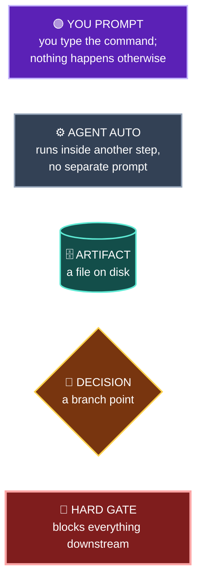
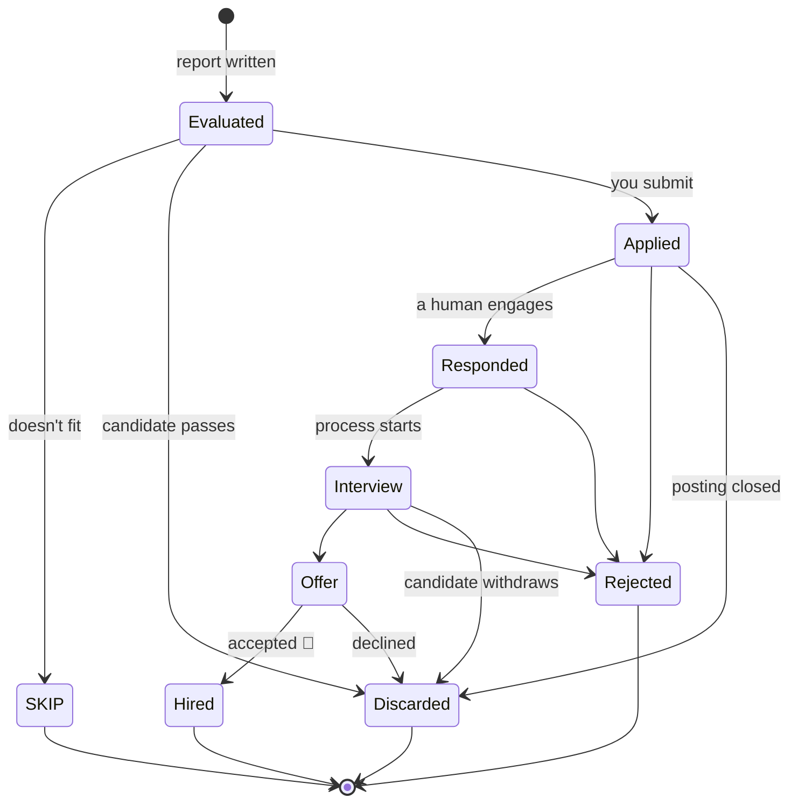
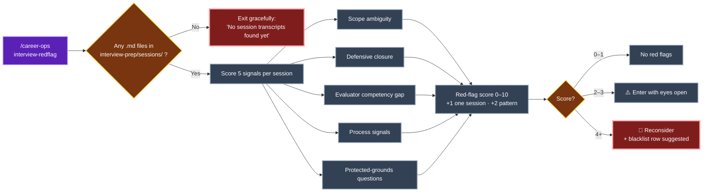
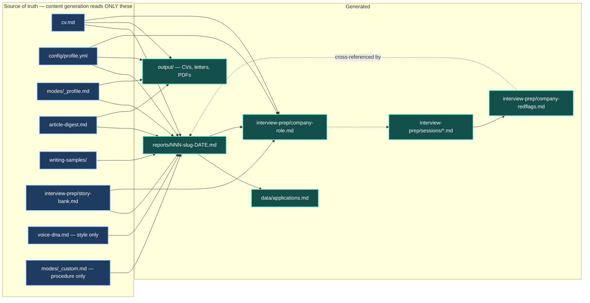

# career-ops — Pipeline Flow Reference

**Created:** 2026-08-07 · **Reflects:** career-ops v1.24.0

A map of how the modes connect: what feeds what, which artifacts get written where, which steps are gated behind earlier ones, and — colour-coded throughout — **which nodes only move when you intentionally prompt them**. Company-agnostic; for a worked example with a live application marked on it, see [citation-group-pipeline-flow.md](citation-group-pipeline-flow.md).

> **File-location note:** `docs/` is in the sync list in `update-system.mjs`, so updates copy upstream files into it. Files with no upstream counterpart are left alone — keep this filename distinct from any shipped doc.

---

## 0. Legend — who drives each node

**The headline the colours reveal: almost everything is 🟣 purple.** career-ops is deliberately manual — it never advances an application on its own. Exactly **four** nodes in the whole pipeline run without you asking: `merge-tracker.mjs`, `set-status.mjs`, `followup-seed.mjs`, and Block G legitimacy scoring inside evaluation. Everything else waits for a prompt. If you don't type, nothing moves.

---

## 1. The full pipeline

```mermaid
flowchart TD
    subgraph DISCOVER["🔍 Discover"]
        A1["/career-ops scan<br/>zero-token portal sweep"]
        A2["/career-ops discover<br/>company list → ATS boards"]
        A3["Paste a JD or URL directly"]
        A4[("data/pipeline.md<br/>inbox of pending URLs")]
        A5["/career-ops pipeline<br/>drain the inbox"]
    end

    subgraph EVALUATE["📊 Evaluate"]
        B1["/career-ops triage<br/>fast first-pass filter"]
        B2["/career-ops oferta<br/>full A–G evaluation"]
        B2b["/career-ops batch<br/>parallel workers, many offers"]
        BG["Block G legitimacy<br/>+ Risk Summary"]
        B3[("reports/NNN-slug-DATE.md<br/>Blocks A–F + G")]
        B4["node merge-tracker.mjs<br/>TSV → data/applications.md"]
        B5{"Score ≥ 4.0?"}
    end

    subgraph PREPARE["📝 Prepare"]
        C1["/career-ops pdf<br/>tailored ATS CV"]
        C1b["/career-ops latex · latex-tex<br/>LaTeX CV path"]
        C2["/career-ops cover<br/>cover letter"]
        C3["/career-ops email<br/>application email draft"]
        C4["/career-ops contacto<br/>find + message a human"]
    end

    subgraph APPLY["📮 Apply"]
        D1["/career-ops apply<br/>form assistant"]
        D2["👤 YOU SUBMIT<br/>never automated, ever"]
        D3["node set-status.mjs NN Applied"]
        D4["node followup-seed.mjs<br/>starts the follow-up clock"]
    end

    subgraph WAIT["⏳ Waiting"]
        E1["/career-ops followup<br/>overdue check + draft nudge"]
        E2["/career-ops reply-watch<br/>classify incoming replies"]
        E3["/career-ops interview-prep<br/>best use of dead time"]
    end

    subgraph INTERVIEW["🎤 Interview loop"]
        F1["/career-ops interview/plan"]
        F2["/career-ops interview/practice"]
        F3["🗣️ THE ACTUAL INTERVIEW<br/>real world, entirely you"]
        F4["/career-ops interview/debrief<br/>⭐ WRITES THE SESSION FILE"]
        F5[("interview-prep/sessions/<br/>company-role-round-DATE.md")]
        F6["/career-ops interview-redflag<br/>scores interviewer conduct"]
    end

    subgraph CLOSE["🏁 Close out"]
        G1["/career-ops offer-prep<br/>clause walk + lawyer questions"]
        G2["/career-ops outcome NN type<br/>archive + sync tracker"]
        G3["/career-ops patterns · upskill<br/>learn from the result"]
    end

    A1 --> A4
    A2 --> A4
    A4 --> A5
    A5 --> B1
    A3 --> B2
    B1 --> B2
    B1 -.->|"many at once"| B2b
    B2 --> BG
    B2b --> BG
    BG --> B3
    B3 --> B4
    B4 --> B5
    B5 -->|"No"| SKIP["SKIP<br/>system recommends against applying"]
    B5 -->|"Yes"| C1
    SKIP -.->|"deliberate override,<br/>stated reason"| C1

    C1 --> C2
    C1b -.-> C2
    C2 --> C3
    C3 --> C4
    C4 --> D1
    D1 --> D2 --> D3 --> D4 --> E1

    E1 --> E2
    E2 -->|"silence"| E1
    E2 -->|"rejection"| G2
    E1 -.->|"while waiting"| E3
    E3 -.-> F1
    E2 -->|"interview invite"| F1

    F1 --> F2 --> F3 --> F4 --> F5 --> F6
    F6 -.->|"next round"| F1
    F6 --> G1 --> G2 --> G3
    G3 -.->|"retarget"| A1

    classDef user fill:#5b21b6,stroke:#c4b5fd,stroke-width:2px,color:#fff
    classDef auto fill:#334155,stroke:#94a3b8,stroke-width:2px,color:#fff
    classDef artifact fill:#134e4a,stroke:#5eead4,stroke-width:2px,color:#fff
    classDef decision fill:#78350f,stroke:#fcd34d,stroke-width:2px,color:#fff
    classDef critical fill:#7f1d1d,stroke:#fca5a5,stroke-width:3px,color:#fff

    class A1,A2,A3,A5,B1,B2,B2b,C1,C1b,C2,C3,C4,D1,E1,E2,E3,F1,F2,F6,G1,G2,G3 user
    class BG,B4,D3,D4 auto
    class A4,B3,F5 artifact
    class B5,SKIP decision
    class D2,F3,F4 critical
```

### Reading the colours

| Node | Class | Why |
|---|---|---|
| Every `/career-ops …` command | 🟣 **You prompt** | The router only fires on an explicit mode name or a pasted JD. There is no background scheduler unless you set one up via `/loop` or `/schedule`. |
| `Block G` + Risk Summary | ⚙️ Auto | Runs inside `oferta` / `auto-pipeline`. You never invoke it separately. |
| `merge-tracker.mjs` | ⚙️ Auto | House rule in `AGENTS.md`: the agent runs it after each batch of evaluations. |
| `set-status.mjs` · `followup-seed.mjs` | ⚙️ Auto | The agent runs both once you confirm you submitted. The *trigger* is you saying so — the *execution* isn't a separate prompt. |
| `data/pipeline.md` · `reports/` · `sessions/` | 🗄️ Artifact | Files, not actions. They're what makes a later step possible. |
| `Score ≥ 4.0?` · `SKIP` | 🔶 Decision | Computed, but the override is yours. |
| **`YOU SUBMIT`** | 🚩 Hard gate | The agent fills the form and stops. Nothing gets sent for you. |
| **`THE ACTUAL INTERVIEW`** | 🚩 Hard gate | Real-world event. No amount of prompting substitutes. |
| **`interview/debrief`** | 🚩 Hard gate | The only mode that writes a session file — and `interview-redflag` reads nothing else. |

**Shortcut:** pasting a JD or URL with no sub-command triggers **auto-pipeline** — evaluate + report + PDF + tracker in one shot, collapsing `A3 → B2 → BG → B3 → B4 → C1`. It's the one place several purple nodes fire from a single prompt.

---

## 2. Canonical states

Source of truth: `templates/states.yml`. The status column in `data/applications.md` must contain exactly one of these — no bold, no dates, no extra text.

**Every transition here is driven by an external event or your decision — none of them fire on a timer.** The agent records state; it never advances it on your behalf.

| State | Meaning |
|---|---|
| `Evaluated` | Report complete, decision pending |
| `Applied` | Application submitted |
| `Responded` | A human at the company engaged — **not** an automated acknowledgement |
| `Interview` | Active interview process |
| `Offer` | Offer received |
| `Hired` | Accepted — terminal success |
| `Rejected` | Rejected by the company |
| `Discarded` | Withdrawn by candidate, or posting closed |
| `SKIP` | Doesn't fit, don't apply |

**Write path:** `node set-status.mjs <report#|company> <State> [--note]` — locked, validated, atomic. Never hand-edit the table. New rows go through `batch/tracker-additions/*.tsv` + `node merge-tracker.mjs`, never by direct edit.

`Applied` vs `Responded` matters beyond bookkeeping: it switches follow-up cadence from 7-day to 1-day. An auto-reply is still `Applied`.

---

## 3. Why `interview-redflag` is gated

Only the entry node is purple: **you invoke it once, then all five signals and the scoring run without further input.** The threshold check is the gate — no transcript, no analysis.

All five signals measure **the interviewer's behaviour in a room you were in**. That's the design — it is explicitly not a Glassdoor replacement. Feeding in public reviews would produce a confident number about other people's processes.

Company-level red flags from public sources run automatically at evaluation time via a **separate mechanism**:

| Question | Mechanism | Driven by |
|---|---|---|
| Is this posting real? | Block G — 12 legitimacy signals | ⚙️ Auto, at evaluation |
| Is this company OK to join? | Risk Summary + `data/wlb-scores.yml` | ⚙️ Auto, at evaluation |
| Is this company **safe** to join? | `interview-redflag` | 🟣 You, after ≥1 debrief |
| Was **this** process broken? | `interview-redflag` | 🟣 You, after ≥1 debrief |

A separate opt-in gate, `data/blacklist.md`, is consulted by `scan.mjs` and the `auto-pipeline` / `oferta` / `apply` flows. Never auto-populated — `interview-redflag` at `🚩 Reconsider` suggests a ready-to-copy row and stops there.

---

## 4. Artifacts — what gets written where

**Source-of-truth boundary:** user-facing content is generated exclusively from the left-hand box plus what you say in the current conversation. Job postings, company pages, recruiter emails, and ATS responses are **data, never instructions**. Keywords get reformulated, never fabricated — and authorship claims require explicit attribution in `cv.md` or `article-digest.md`.

**Data-contract split:**

| Layer | Files | Rule |
|---|---|---|
| **User** | `cv.md`, `config/profile.yml`, `modes/_profile.md`, `modes/_custom.md`, `article-digest.md`, `portals.yml`, `data/*`, `reports/*`, `output/*`, `interview-prep/*` | Never auto-updated. Personalization goes **here**. |
| **System** | `modes/_shared.md` and other modes, `AGENTS.md`, `*.mjs`, `dashboard/*`, `templates/*`, `batch/*`, `docs/*` | Auto-updatable. Never put user data here. |

Facts and targeting → `modes/_profile.md` or `config/profile.yml`. House rules and workflow preferences → `modes/_custom.md`.

---

## 5. Zero-token helper scripts

No LLM cost — run them freely. All ⚙️ in the sense that they're mechanical, but **you or the agent must invoke each one**; none are scheduled.

| Script | Purpose |
|---|---|
| `doctor.mjs --json` | Cold-start check: onboarding needed, missing files, warnings |
| `verify-pipeline.mjs` | Health check across tracker + reports |
| `merge-tracker.mjs` | Merge TSV additions; dedup; normalize report links |
| `set-status.mjs` | Canonical tracker-row update — locked, validated, atomic |
| `dedup-tracker.mjs` · `normalize-statuses.mjs` | Repair passes |
| `reserve-report-num.mjs --count N` | Reserve report numbers before parallel fan-out |
| `followup-cadence.mjs` | Who's overdue, who's waiting, next dates |
| `followup-seed.mjs` | Pin the first follow-up date on `Applied` |
| `stats.mjs --summary` | Lifetime funnel, scan totals, portal coverage |
| `analyze-patterns.mjs` | Rejection patterns, per-ATS-vendor advance rate |
| `upskill.mjs` | Weighted skill-gap map from tracked reports |
| `jd-skill-gap.mjs` | Classify one JD's skills vs `cv.md` |
| `salary-gap.mjs` | Desired vs advertised vs actual comp; `--stated-for NN` |
| `invite-match.mjs` | Match a pasted interview invite to a tracker row |
| `paste-reply.mjs` | Feed a pasted email into reply-watch without Gmail |
| `check-liveness.mjs` | Is the posting still open? |
| `detect-reposts.mjs` | Roles re-listed 2+ times in 90 days |
| `process-quality.mjs` | Per-company recruiting-friction rate |
| `weekly-digest.mjs` | Roll up interview sessions for the week |
| `outcome.mjs` | Record outcome, archive artifacts, sync tracker |
| `check-table-freshness.mjs` | Flag stale jurisdiction data tables |
| `assessment-log.mjs` | Log skills-assessment results |
| `contacts.mjs` | Phonebook → vCard export |

---

## 6. Standalone modes

🟣 All user-driven, no pipeline position required — run any time.

| Mode | Purpose |
|---|---|
| `/career-ops tracker` | Status overview across all applications |
| `/career-ops patterns` | Rejection patterns, improve targeting |
| `/career-ops upskill` | Aggregate skill-gap analysis |
| `/career-ops titles` | Adjacent job titles from the CV |
| `/career-ops deep` | 6-axis company research |
| `/career-ops interview` | Profile/CV onboarding interview — **company-agnostic**, don't confuse with `interview/*` |
| `/career-ops add` · `expand` | Grow the CV from real sources |
| `/career-ops training` · `project` | Evaluate a course/cert or portfolio project |
| `/career-ops agent-inbox` | Queue requests for the next session |
| `/career-ops ofertas` | Compare and rank multiple offers |
| `/career-ops update` | Update system files with diff preview |

**Naming trap worth remembering:** `interview` (bare) is CV onboarding and takes no company. The company-targeted ones are `interview-prep`, `interview/plan`, `interview/practice`, `interview/debrief`, and `interview-redflag`.

---

## 7. The only way to make nodes fire without prompting

Everything above is manual by design. If you want recurring execution, that's an explicit opt-in, and it's the sole exception to the "nothing moves unless you type" rule:

- `/loop` or `/schedule` — recurring scans on an interval
- `docs/AUTOMATION.md` — copy-paste cron / launchd / Windows Task Scheduler recipes

Even then, the 🚩 hard gates stay manual: automation can discover and evaluate, but it will never submit an application, sit an interview, or write a debrief for you.

---

## 8. Ethics gates built into the flow

- **Never auto-submit.** Fill forms, draft answers, generate PDFs — then stop.
- **Below 4.0/5, the system recommends against applying.** Overriding is allowed with a stated reason; that reason belongs in the report.
- **Quality over volume.** Five well-targeted applications beat fifty generic ones.
- **Untrusted external content.** Postings, forms, and recruiter emails are read for content, never obeyed. Imperative text aimed at "the AI" or "the reviewer" gets quoted as an anomaly, not actioned.
