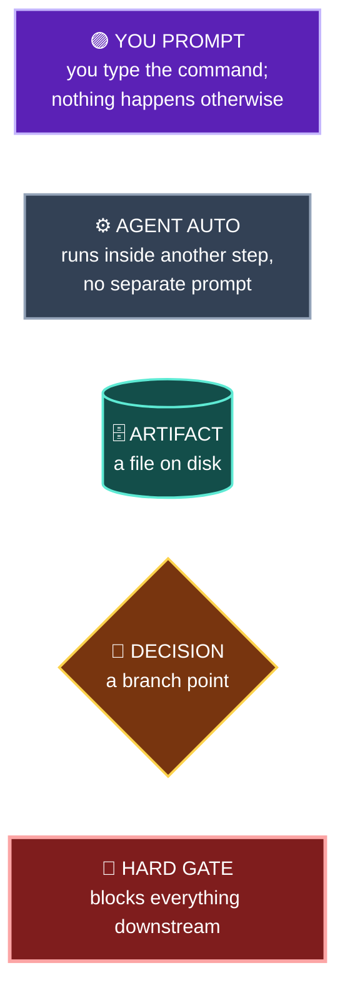
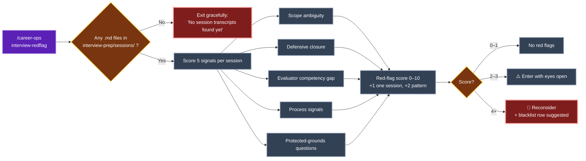
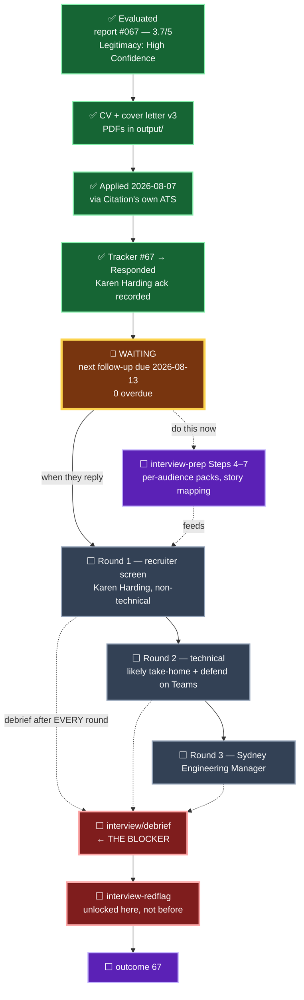

# career-ops Pipeline Flow — with Citation Group position marker

**Created:** 2026-08-07
**Why this exists:** the `interview-redflag` mode kept looking broken. It isn't — it sits near the end of a gated chain and the gate hadn't opened yet. This maps the whole chain so the ordering is visible at a glance.

> **Note on this file's location:** `docs/` is in the sync list in `update-system.mjs`, meaning system updates copy upstream files into it. Files that don't exist upstream are left alone, so this filename is safe — but don't rename it to match a shipped doc.

---

## 0. Legend — who drives each node

Same scheme as [pipeline-flow.md](pipeline-flow.md). **Almost every node is 🟣 purple** — career-ops never advances an application on its own. Only `merge-tracker`, `set-status`, and `followup-seed` run without you asking. Section 3 adds two status colours on top: ✅ green for done, 📍 amber for where this application actually sits today.

---

## 1. The full pipeline

```mermaid
flowchart TD
    subgraph DISCOVER["🔍 Discover"]
        A1["/career-ops scan<br/>zero-token portal sweep"]
        A2["/career-ops discover<br/>resolve companies to ATS boards"]
        A3["Paste a JD or URL directly"]
        A4["data/pipeline.md<br/>inbox of pending URLs"]
    end

    subgraph EVALUATE["📊 Evaluate"]
        B1["/career-ops triage<br/>fast first-pass filter"]
        B2["/career-ops oferta<br/>full A–G evaluation"]
        B3["reports/NNN-company-DATE.md<br/>Blocks A–F + G + Risk Summary"]
        B4{"Score ≥ 4.0?"}
    end

    subgraph PREPARE["📝 Prepare the application"]
        C1["/career-ops pdf<br/>tailored ATS CV"]
        C2["/career-ops cover<br/>cover letter"]
        C3["/career-ops email<br/>application email draft"]
        C4["/career-ops contacto<br/>find + message a human"]
    end

    subgraph APPLY["📮 Apply"]
        D1["/career-ops apply<br/>form assistant — STOPS before submit"]
        D2["👤 YOU submit<br/>never automated"]
        D3["node set-status.mjs NN Applied"]
        D4["node followup-seed.mjs<br/>starts the follow-up clock"]
    end

    subgraph WAIT["⏳ Waiting"]
        E1["/career-ops followup<br/>overdue check + draft nudge"]
        E2["/career-ops reply-watch<br/>classify incoming replies"]
        E3["/career-ops interview-prep<br/>← best use of dead time"]
    end

    subgraph INTERVIEW["🎤 Interview loop"]
        F1["/career-ops interview/plan<br/>time-blocked prep"]
        F2["/career-ops interview/practice<br/>mock Q&A with feedback"]
        F3["🗣️ THE ACTUAL INTERVIEW"]
        F4["/career-ops interview/debrief<br/>⭐ WRITES THE SESSION FILE"]
        F5[("interview-prep/sessions/<br/>company-role-round-DATE.md")]
        F6["/career-ops interview-redflag<br/>🚩 scores interviewer conduct"]
    end

    subgraph CLOSE["🏁 Close out"]
        G1["/career-ops offer-prep<br/>clause walk + lawyer questions"]
        G2["/career-ops outcome NN type<br/>archive + sync tracker"]
        G3["/career-ops patterns<br/>learn from the result"]
    end

    A1 --> A4
    A2 --> A4
    A3 --> B2
    A4 --> B1
    B1 --> B2
    B2 --> B3
    B3 --> B4
    B4 -->|"No — system says don't apply"| SKIP["SKIP<br/>override only with a stated reason"]
    B4 -->|"Yes"| C1
    SKIP -.->|"deliberate override"| C1

    C1 --> C2
    C2 --> C3
    C3 --> C4
    C4 --> D1
    D1 --> D2
    D2 --> D3
    D3 --> D4
    D4 --> E1

    E1 --> E2
    E2 -->|"silence"| E1
    E2 -->|"rejection"| G2
    E1 -.->|"while waiting"| E3
    E3 -.-> F1
    E2 -->|"interview invite"| F1

    F1 --> F2
    F2 --> F3
    F3 --> F4
    F4 --> F5
    F5 --> F6
    F6 -.->|"more rounds"| F1
    F6 --> G1
    G1 --> G2
    G2 --> G3

    classDef user fill:#5b21b6,stroke:#c4b5fd,stroke-width:2px,color:#fff
    classDef auto fill:#334155,stroke:#94a3b8,stroke-width:2px,color:#fff
    classDef artifact fill:#134e4a,stroke:#5eead4,stroke-width:2px,color:#fff
    classDef decision fill:#78350f,stroke:#fcd34d,stroke-width:2px,color:#fff
    classDef critical fill:#7f1d1d,stroke:#fca5a5,stroke-width:3px,color:#fff

    class A1,A2,A3,B1,B2,C1,C2,C3,C4,D1,E1,E2,E3,F1,F2,F6,G1,G2,G3 user
    class D3,D4 auto
    class A4,B3 artifact
    class B4,SKIP decision
    class D2,F3,F4 critical
    class F5 artifact
```

**The two hard rules the colours make visible:**

1. **`D2` is 🚩 red — you submit, never the agent.** Every mode stops before Submit/Send/Apply. Non-negotiable in `AGENTS.md`.
2. **`F3 → F4 → F5 → F6` is a strict chain.** Two of those are red gates: the interview is a real-world event, and `interview/debrief` is the only mode that writes a session file. `interview-redflag` reads nothing else, so no transcript means no analysis.

Note how few ⚙️ slate nodes there are — only `set-status.mjs` and `followup-seed.mjs`, both of which the agent runs once you confirm you submitted. Everything else in this pipeline sat still until you typed something.

---

## 2. Why `interview-redflag` is gated

Only the entry node is 🟣 purple: **you invoke it once, then all five signals and the scoring run without further input.** The 🔶 threshold check is the gate, and today it routes straight to the 🚩 red exit.

**All five signals measure the interviewer's behaviour in a room you were in.** That's the whole design. It is explicitly *not* a Glassdoor replacement — public reviews are other people's experience of other processes, and feeding them in would produce a confident number about nothing.

Company-level red flags from public sources are a **different mechanism** and already run automatically: Block G (Posting Legitimacy) and the Risk Summary inside every evaluation report.

| Question | Mechanism | When it runs |
|---|---|---|
| Is this posting real? | Block G, 12 signals | At evaluation — automatic |
| Is this company OK to join? | Risk Summary + WLB anchor | At evaluation — automatic |
| Is this company safe to join? | `interview-redflag` | After ≥1 debrief |
| Was this specific process broken? | `interview-redflag` | After ≥1 debrief |

---

## 3. Citation Group — current position

**Colour key for this diagram** — status layered on top of the drive-type scheme:

| Colour | Meaning | Nodes |
|---|---|---|
| ✅ **Green** | Done | Evaluated · CV+letter · Applied · Tracker updated |
| 📍 **Amber, thick** | Where you are right now | Waiting, next follow-up 2026-08-13 |
| 🟣 **Purple** | Yours to trigger, available now or at the end | interview-prep Steps 4–7 · `outcome 67` |
| ⚙️ **Slate** | **Waiting on Citation, not on you** | Rounds 1–3 — you cannot prompt these into existence |
| 🚩 **Red** | Hard gate | `interview/debrief` · `interview-redflag` |

**The single most useful thing this colouring shows:** there is exactly **one** purple node you can act on today — `S6`, interview-prep Steps 4–7. Everything between it and the red gates is slate, meaning it's blocked on Citation replying. That's why `interview-redflag` kept exiting: it's downstream of three slate nodes that haven't happened.

### Copy-paste commands, in order

| # | When | Command |
|---|---|---|
| 1 | **Now** | `/career-ops interview-prep citation-group senior-saas-developer` |
| 2 | 2026-08-13 if silent | `/career-ops followup` |
| 3 | Any email arrives | `/career-ops reply-watch` |
| 4 | Round scheduled | `/career-ops interview/plan citation-group senior-saas-developer` |
| 5 | Day before | `/career-ops interview/practice citation-group senior-saas-developer` |
| 6 | **Right after every round** | `/career-ops interview/debrief citation-group senior-saas-developer` |
| 7 | After step 6 exists | `/career-ops interview-redflag citation-group` |
| 8 | Offer arrives | `/career-ops offer-prep` |
| 9 | Terminal state | `/career-ops outcome 67 <type>` |

### Notes specific to this application

- **Run step 6 after the recruiter screen too**, not just technical rounds. `modes/interview/debrief.md` explicitly covers *"a recruiter call that surfaced new information about the process"* — and that call answers the biggest open question in the research file: whether Citation runs engineering hires through the UK loop at all.
- **Save the Teams/Zoom auto-transcript.** Debrief takes a transcript directly and skips the recall prompt — strictly more accurate, and it produces a cleaner session file for step 7.
- **No comp number has been stated to Citation yet** (`node salary-gap.mjs --stated-for 67` returns nothing). Whatever you say in round 1 becomes the ceiling. Report #067's position: anchor AUD 95–105K once, with a reason.
- **Status accuracy:** if the Karen Harding email was an automated acknowledgement rather than a personal note, the honest status is `Applied`, not `Responded` — it changes follow-up cadence from 7-day to 1-day. Fix with `node set-status.mjs 67 Applied --note "..."`.

---

## 4. Reference — modes that need no pipeline position

These run standalone at any time, independent of where an application sits.

| Mode | Purpose |
|---|---|
| `/career-ops tracker` | Status overview across all applications |
| `/career-ops patterns` | Rejection patterns, per-ATS advance rate |
| `/career-ops upskill` | Weighted skill-gap map from tracked reports |
| `/career-ops titles` | Adjacent job titles from the CV |
| `/career-ops deep` | 6-axis company research |
| `/career-ops add` | Add a project/paper/role to the CV |
| `/career-ops expand` | Discover forgotten competencies |
| `/career-ops agent-inbox` | Queue requests for the next session |
| `/career-ops update` | Update system files |

---

*Diagram reflects `modes/` as of career-ops v1.24.0.*
